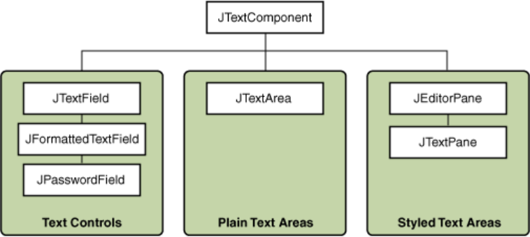

这一部分提供了在使用 Swing 文本组件时可能需要的背景信息。如果您打算使用一个未经样式化的文本组件（如文本字段、密码字段、格式化文本字段或文本区域），请转到其使用说明页面，只有在必要时才返回到这里。如果您打算使用一个带样式的文本组件，
请参阅“如何使用编辑器窗格和文本窗格”，并阅读本节。如果您不知道需要哪种组件，请继续阅读。

Swing 文本组件显示文本，并可选择允许用户编辑文本。程序需要文本组件来完成各种任务，从简单的（输入一个单词并按 Enter 键）到复杂的（显示和编辑带有嵌入式图像的带样式文本，使用亚洲语言）。

Swing 提供了六种文本组件，以及支持的类和接口，满足了最复杂的文本需求。尽管它们用途和功能各不相同，但所有 Swing 文本组件都继承自相同的超类 JTextComponent，它为文本操作提供了高度可配置和强大的基础。

下图显示了 JTextComponent 层次结构。  

以下图片显示了一个名为 TextSamplerDemo 的应用程序，该应用程序使用了每个 Swing 文本组件。  

TextSamplerDemo 示例以非常基本的方式使用文本组件。以下表格告诉您如何使用每种类型的文本组件。
| 组别             | 描述                                                                                                                                                                                                                                                                                                           | Swing 类 |
|------------------|--------------------------------------------------------------------------------------------------------------------------------------------------------------------------------------------------------------------------------------------------------------------------------------------------------------------------------------------------------------------------------|----------|
| 文本控件          | 也称为文本字段，文本控件只能显示一行可编辑文本。与按钮类似，它们会生成动作事件。用于从用户获取少量文本信息，并在完成文本输入后执行操作。                                                                                                                                                                                                                                                                                               | JTextField 和其子类 JPasswordField 和 JFormattedTextField |
| 纯文本区域        | JTextArea 可以显示多行可编辑文本。虽然文本区域可以使用任何字体显示文本，但所有文本都是相同的字体。用于允许用户输入任意长度的未格式化文本或显示未格式化的帮助信息。                                                                                                                                                                                                                                                                   | JTextArea                                                            |
| 带样式文本区域    | 带样式文本组件可以使用多种字体显示可编辑文本。一些带样式文本组件允许嵌入图像甚至嵌入组件。带样式文本组件是功能强大、多功能的组件，适用于高端需求，并提供比其他文本组件更多的定制选项。由于它们功能强大且灵活，带样式文本组件通常需要更多的初始编程来设置和使用。一个例外是编辑器窗格可以轻松从 URL 加载格式化文本，这使得它们对于显示不可编辑的帮助信息很有用。 | JEditorPane 和其子类 JTextPane                                      |

本教程提供了有关 JTextComponent 类所建立的基础的信息，并告诉您如何完成一些常见的与文本相关的任务。

要了解更多关于 JavaFX 中文本组件的信息，请参阅《在 JavaFX 中使用文本和文本效果》和《使用 JavaFX UI 控件：文本字段》教程。

